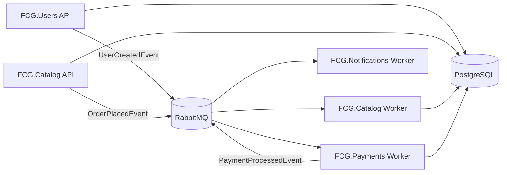

# FCG.Infra

Repositório de **orquestração** da plataforma FCG. Centraliza a infraestrutura compartilhada (PostgreSQL, RabbitMQ) e as instruções para executar todos os microsserviços com **Docker Compose** ou **Kubernetes**.

## Microsserviços

| Repositório | Finalidade | Porta (Docker) |
|---|---|---|
| [FCG.Users](../FCG.Users) | Cadastro e autenticação JWT | `5001` |
| [FCG.Catalog](../FCG.Catalog) | Catálogo, biblioteca e compras | `5002` |
| [FCG.Payments](../FCG.Payments) | Processamento assíncrono de pagamentos | — |
| [FCG.Notifications](../FCG.Notifications) | Simulação de e-mails via log | — |

## Arquitetura



## Pré-requisitos

- [Docker Desktop](https://www.docker.com/products/docker-desktop/) (Compose v2+)
- Para Kubernetes: cluster local ([Minikube](https://minikube.sigs.k8s.io/), [Kind](https://kind.sigs.k8s.io/)) ou cloud com `kubectl` configurado

---

## Executar com Docker Compose

### 1. Subir a stack

Na raiz deste repositório:

```bash
docker compose up -d
```

Para ver os logs:

```bash
docker compose logs -f
```

Para parar e remover os containers:

```bash
docker compose down
```

Para remover também os volumes (dados do Postgres e RabbitMQ):

```bash
docker compose down -v
```

### 2. Serviços e portas

| Serviço | Imagem | Porta host |
|---|---|---|
| PostgreSQL | `postgres:17` | `5435` |
| RabbitMQ (AMQP) | `rabbitmq:4-management` | `5672` |
| RabbitMQ (Management UI) | `rabbitmq:4-management` | `15672` |
| Users API | `gabrielnatan2001/fcg-api-users:latest` | `5001` |
| Catalog API | `gabrielnatan2001/fcg-api-catalog:latest` | `5002` |
| Catalog Worker | `gabrielnatan2001/fcg-worker-catalog:latest` | — |
| Payments Worker | `gabrielnatan2001/fcg-worker-payments:latest` | — |
| Notifications Worker | `gabrielnatan2001/fcg-worker-notifications:latest` | — |

### 3. Credenciais padrão

| Serviço | Usuário | Senha |
|---|---|---|
| PostgreSQL | `postgres` | `postgres` |
| RabbitMQ | `admin` | `admin` |

Bancos criados automaticamente no primeiro start: `fcg_users`, `fcg_catalog`, `fcg_payments` (script em `postgres/init/init.sql`).

### 4. Endpoints

| Recurso | URL |
|---|---|
| Users Swagger | http://localhost:5001/swagger |
| Catalog Swagger | http://localhost:5002/swagger |
| RabbitMQ UI | http://localhost:15672 |

Usuário admin (seed do Users): `admin@admin.com` / `Teste@123`

### 5. Mensageria

Exchanges, filas e bindings são **criados automaticamente** pelos microsserviços ao publicar ou consumir mensagens. Não é necessária configuração manual no RabbitMQ.

---

## Deploy no Kubernetes

Os manifests estão organizados por repositório. Aplique na ordem abaixo para garantir que a infraestrutura esteja disponível antes dos apps.

### 1. Infraestrutura (este repositório)

```bash
kubectl apply -f postgres/k8s/
kubectl apply -f rabbitmq/k8s/
```

Aguarde os pods ficarem prontos:

```bash
kubectl get pods -w
```

### 2. Workers e APIs (demais repositórios)

```bash
kubectl apply -f ../FCG.Notifications/k8s/
kubectl apply -f ../FCG.Payments/k8s/
kubectl apply -f ../FCG.Catalog/k8s/
kubectl apply -f ../FCG.Users/k8s/
```

> Aplique o **Notifications Worker antes do Users API**, pois o Users publica eventos consumidos por ele.

### 3. Acesso aos serviços (NodePort)

| Serviço | NodePort |
|---|---|
| Users API | `30001` |
| Catalog API | `30002` |
| PostgreSQL | `30432` |
| RabbitMQ AMQP | `30672` |
| RabbitMQ Management | `31672` |

Exemplo com Minikube:

```bash
minikube service fcg-users-api --url
minikube service fcg-catalog-api --url
```

Ou acesse diretamente pelo IP do node: `http://<node-ip>:30001/swagger`

### 4. Variáveis de ambiente no Kubernetes

Cada microsserviço define variáveis em `ConfigMap` (não sensíveis) e `Secret` (conexões e chaves). Detalhes por serviço:

- [FCG.Users — variáveis](../FCG.Users/README.md)
- [FCG.Catalog — variáveis](../FCG.Catalog/README.md)
- [FCG.Payments — variáveis](../FCG.Payments/README.md)
- [FCG.Notifications — variáveis](../FCG.Notifications/README.md)

Em todos os ambientes containerizados, `ASPNETCORE_ENVIRONMENT=Production` — as configurações vêm dos manifests ou do `docker-compose.yml`.

### 5. Comandos úteis

```bash
# Status geral
kubectl get pods,services,deployments

# Logs de um pod
kubectl logs -f <nome-do-pod>

# Reiniciar um deployment
kubectl rollout restart deployment fcg-users-api

# Remover tudo (infra + apps)
kubectl delete -f ../FCG.Users/k8s/
kubectl delete -f ../FCG.Catalog/k8s/
kubectl delete -f ../FCG.Payments/k8s/
kubectl delete -f ../FCG.Notifications/k8s/
kubectl delete -f rabbitmq/k8s/
kubectl delete -f postgres/k8s/
```

---

## Estrutura do repositório

```
FCG.Infra/
├── docker-compose.yml          # Stack completa com imagens do Docker Hub
├── postgres/
│   ├── init/init.sql           # Criação dos bancos no primeiro start
│   └── k8s/                    # Manifests PostgreSQL
└── rabbitmq/
    └── k8s/                    # Manifests RabbitMQ
```

## Imagens Docker Hub

| Imagem | Descrição |
|---|---|
| `gabrielnatan2001/fcg-api-users` | API de usuários |
| `gabrielnatan2001/fcg-api-catalog` | API de catálogo |
| `gabrielnatan2001/fcg-worker-catalog` | Worker de pagamentos do catálogo |
| `gabrielnatan2001/fcg-worker-payments` | Worker de pagamentos |
| `gabrielnatan2001/fcg-worker-notifications` | Worker de notificações |
